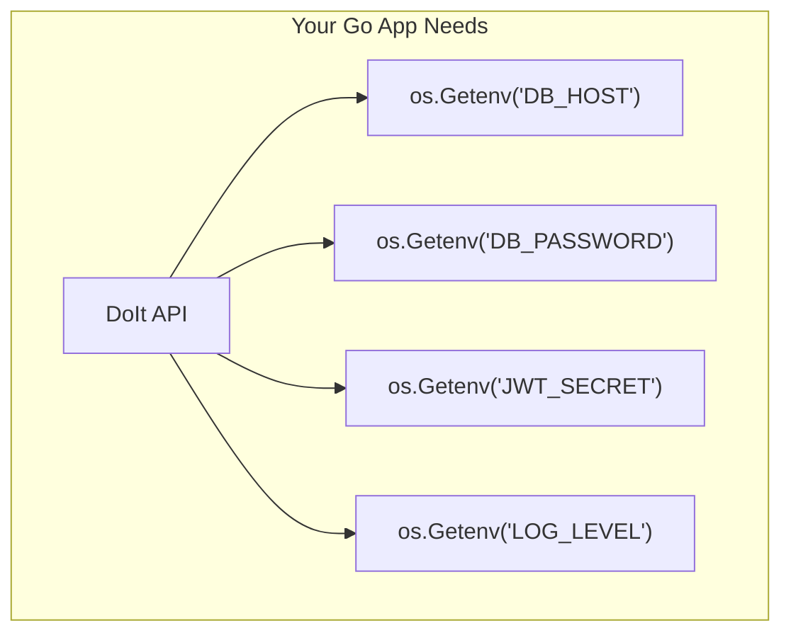
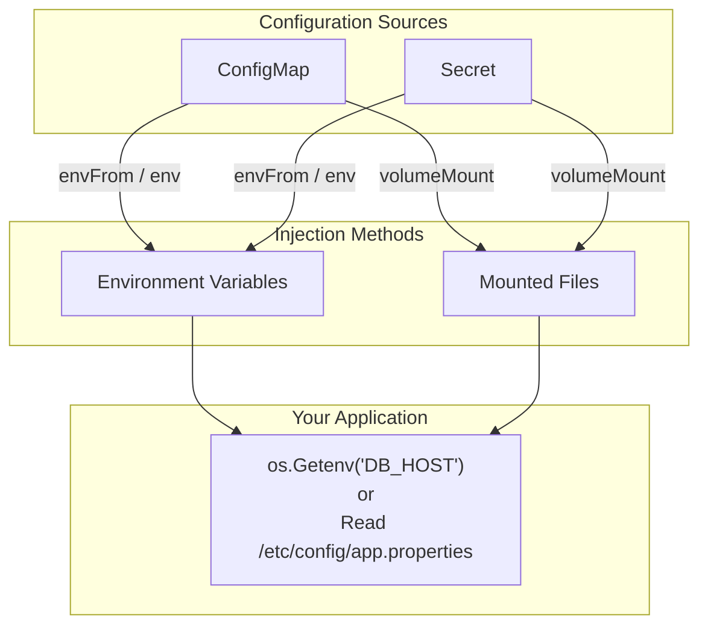
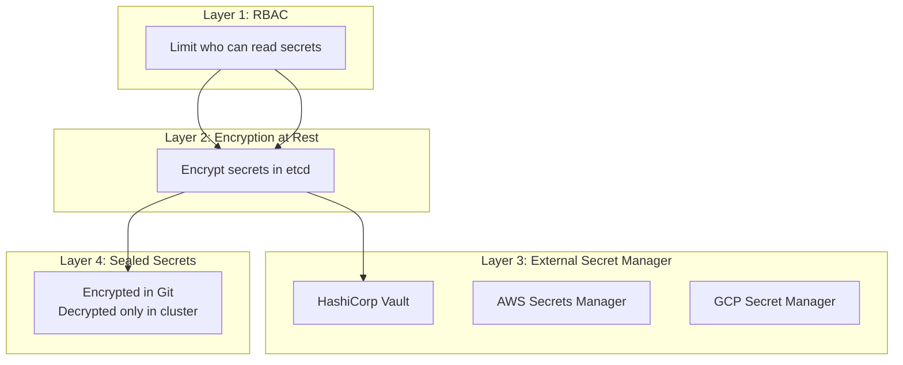

# Kubernetes ConfigMaps & Secrets

> **Purpose**: Store and inject configuration into your applications  
> **Key Insight**: ConfigMaps for non-sensitive data, Secrets for sensitive data

---

## Table of Contents

1. [The Problem: Where Does Configuration Come From?](#the-problem)
2. [ConfigMap vs Secret](#configmap-vs-secret)
3. [Creating ConfigMaps](#creating-configmaps)
4. [Creating Secrets](#creating-secrets)
5. [Using ConfigMaps and Secrets in Pods](#using-in-pods)
6. [Three Methods to Inject Configuration](#three-methods)
7. [Production Security Considerations](#production-security)
8. [Quick Reference](#quick-reference)

---

## The Problem: Where Does Configuration Come From? {#the-problem}

Your application needs configuration values:



**In Docker Compose:** Environment variables in `docker-compose.yml`  
**In Kubernetes:** ConfigMaps and Secrets!

---

## ConfigMap vs Secret {#configmap-vs-secret}

```mermaid
graph TB
    subgraph "ConfigMap"
        CM_TITLE["For NON-SENSITIVE data"]
        CM1["Database host/port"]
        CM2["Log level"]
        CM3["Feature flags"]
        CM4["Service URLs"]
        CM_STORE["Stored as: Plain text"]
    end
    
    subgraph "Secret"
        SEC_TITLE["For SENSITIVE data"]
        SEC1["Passwords"]
        SEC2["API keys"]
        SEC3["JWT secrets"]
        SEC4["TLS certificates"]
        SEC_STORE["Stored as: Base64 encoded"]
    end
    
    style CM_TITLE fill:#1a1a1a
    style SEC_TITLE fill:#1a1a1a
    style CM_STORE fill:#1a1a1a
    style SEC_STORE fill:#1a1a1a
```



### Comparison Table

| Aspect | ConfigMap | Secret |
|--------|-----------|--------|
| **Data type** | Non-sensitive | Sensitive |
| **Storage** | Plain text | Base64 encoded |
| **kubectl describe** | Shows values | Hides values (shows size only) |
| **YAML field** | `data:` | `stringData:` or `data:` |
| **Example data** | DB_HOST, LOG_LEVEL | DB_PASSWORD, JWT_SECRET |

---

## Creating ConfigMaps {#creating-configmaps}

### Basic ConfigMap

```yaml
apiVersion: v1
kind: ConfigMap
metadata:
  name: app-config
data:
  # Simple key-value pairs
  DB_HOST: "postgres"
  DB_PORT: "5432"
  DB_NAME: "doit"
  LOG_LEVEL: "info"
  
  # Multi-line config file
  app.properties: |
    server.port=8080
    server.timeout=30s
    feature.new-ui=true
```

### Create from Command Line

```bash
# From literal values
kubectl create configmap app-config \
  --from-literal=DB_HOST=postgres \
  --from-literal=DB_PORT=5432

# From a file
kubectl create configmap app-config \
  --from-file=config.properties

# From a directory (each file becomes a key)
kubectl create configmap app-config \
  --from-file=./config-dir/
```

### View ConfigMap

```bash
# List all ConfigMaps
kubectl get configmaps

# View details (shows values)
kubectl describe configmap app-config

# Get as YAML
kubectl get configmap app-config -o yaml
```

---

## Creating Secrets {#creating-secrets}

### Basic Secret (using stringData - easier)

```yaml
apiVersion: v1
kind: Secret
metadata:
  name: app-secrets
type: Opaque
stringData:          # Plain text - K8s encodes it for you
  DB_USER: "doit"
  DB_PASSWORD: "doit123"
  JWT_SECRET: "my-super-secret-key"
```

### Using data (pre-encoded)

```yaml
apiVersion: v1
kind: Secret
metadata:
  name: app-secrets
type: Opaque
data:               # Must be base64 encoded
  DB_PASSWORD: ZG9pdDEyMw==    # echo -n "doit123" | base64
```

### Encode/Decode Base64

```bash
# Encode
echo -n "doit123" | base64
# Output: ZG9pdDEyMw==

# Decode
echo "ZG9pdDEyMw==" | base64 -d
# Output: doit123
```

### Create from Command Line

```bash
# From literal values
kubectl create secret generic app-secrets \
  --from-literal=DB_PASSWORD=doit123 \
  --from-literal=JWT_SECRET=my-secret

# From a file
kubectl create secret generic tls-secret \
  --from-file=tls.crt=./cert.pem \
  --from-file=tls.key=./key.pem
```

### View Secret

```bash
# List all Secrets
kubectl get secrets

# View details (values hidden)
kubectl describe secret app-secrets

# See base64 values
kubectl get secret app-secrets -o jsonpath='{.data}'

# Decode a specific value
kubectl get secret app-secrets -o jsonpath='{.data.DB_PASSWORD}' | base64 -d
```

---

## Using ConfigMaps and Secrets in Pods {#using-in-pods}



---

## Three Methods to Inject Configuration {#three-methods}

### Method 1: Individual Environment Variables

Use when you need to **rename keys** or pick specific values:

```yaml
spec:
  containers:
  - name: app
    env:
      # From ConfigMap
      - name: DATABASE_HOST        # Name in container (renamed)
        valueFrom:
          configMapKeyRef:
            name: app-config       # ConfigMap name
            key: DB_HOST           # Key in ConfigMap
      
      # From Secret
      - name: DATABASE_PASSWORD
        valueFrom:
          secretKeyRef:
            name: app-secrets
            key: DB_PASSWORD
```

### Method 2: Load All as Environment Variables

Use for **single source of truth** - all keys become env vars:

```yaml
spec:
  containers:
  - name: app
    envFrom:
      - configMapRef:
          name: app-config      # All keys from ConfigMap
      - secretRef:
          name: app-secrets     # All keys from Secret
```

**Result in container:**
```bash
DB_HOST=postgres
DB_PORT=5432
DB_PASSWORD=doit123
JWT_SECRET=my-super-secret-key
# ... all keys available
```

### Method 3: Mount as Files

Use when your app reads **config files**:

```yaml
spec:
  containers:
  - name: app
    volumeMounts:
      - name: config-volume
        mountPath: /etc/config     # Directory
        readOnly: true
      - name: secret-volume
        mountPath: /etc/secrets
        readOnly: true
  
  volumes:
    - name: config-volume
      configMap:
        name: app-config
    - name: secret-volume
      secret:
        secretName: app-secrets
```

**Result in container:**
```
/etc/config/
├── DB_HOST          (contains: postgres)
├── DB_PORT          (contains: 5432)
└── app.properties   (contains: server.port=8080...)

/etc/secrets/
├── DB_PASSWORD      (contains: doit123)
└── JWT_SECRET       (contains: my-super-secret-key)
```

### Comparison

| Method | Use Case | Example |
|--------|----------|---------|
| **Individual env** | Rename keys, selective loading | `DATABASE_HOST` from `DB_HOST` |
| **envFrom** | Load everything, single source of truth | All config as env vars |
| **Mount files** | App reads config files | `/etc/config/app.properties` |

---

## Production Security Considerations {#production-security}

### ⚠️ Important: Base64 is NOT Encryption!

```bash
# Anyone can decode:
echo "ZG9pdDEyMw==" | base64 -d   # → doit123
```

Kubernetes Secrets provide **separation**, not security by themselves.

### Production Security Layers



### Best Practices

| Practice | Description |
|----------|-------------|
| **Enable Encryption at Rest** | Encrypt secrets in etcd database |
| **Use External Secret Manager** | Vault, AWS Secrets Manager, GCP Secret Manager |
| **Apply RBAC** | Limit who can read secrets |
| **Use Sealed Secrets** | For GitOps workflows |
| **Never commit secrets to Git** | Use `.gitignore` or Sealed Secrets |
| **Rotate secrets regularly** | Automate with external managers |

### Example: RBAC for Secrets

```yaml
apiVersion: rbac.authorization.k8s.io/v1
kind: Role
metadata:
  name: secret-reader
rules:
  - apiGroups: [""]
    resources: ["secrets"]
    verbs: ["get"]                    # Only GET, not LIST
    resourceNames: ["app-secrets"]    # Only specific secret
```

### Security by Environment

| Environment | Approach |
|-------------|----------|
| **Local/Learning** | Plain K8s Secrets |
| **Small Production** | Encryption at Rest + RBAC |
| **Enterprise** | External Secret Manager |
| **GitOps** | Sealed Secrets |

---

## Quick Reference {#quick-reference}

### ConfigMap Commands

```bash
# Create
kubectl create configmap NAME --from-literal=KEY=VALUE
kubectl apply -f configmap.yaml

# View
kubectl get configmaps
kubectl describe configmap NAME
kubectl get configmap NAME -o yaml

# Delete
kubectl delete configmap NAME
```

### Secret Commands

```bash
# Create
kubectl create secret generic NAME --from-literal=KEY=VALUE
kubectl apply -f secret.yaml

# View
kubectl get secrets
kubectl describe secret NAME
kubectl get secret NAME -o jsonpath='{.data.KEY}' | base64 -d

# Delete
kubectl delete secret NAME
```

### Quick YAML Templates

**ConfigMap:**
```yaml
apiVersion: v1
kind: ConfigMap
metadata:
  name: app-config
data:
  KEY: "value"
```

**Secret:**
```yaml
apiVersion: v1
kind: Secret
metadata:
  name: app-secrets
type: Opaque
stringData:
  KEY: "sensitive-value"
```

**Pod using both:**
```yaml
spec:
  containers:
  - name: app
    envFrom:
      - configMapRef:
          name: app-config
      - secretRef:
          name: app-secrets
```

---

## Related Files

- Learning examples: `infra/k8s/learning/05-configmap.yaml`
- Learning examples: `infra/k8s/learning/06-secret.yaml`
- Learning examples: `infra/k8s/learning/07-pod-with-config.yaml`

---

*Last Updated: January 2026*

