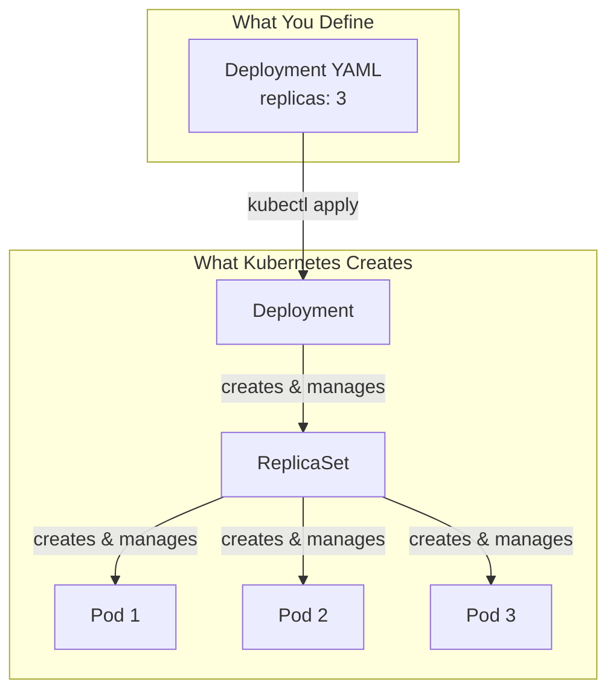
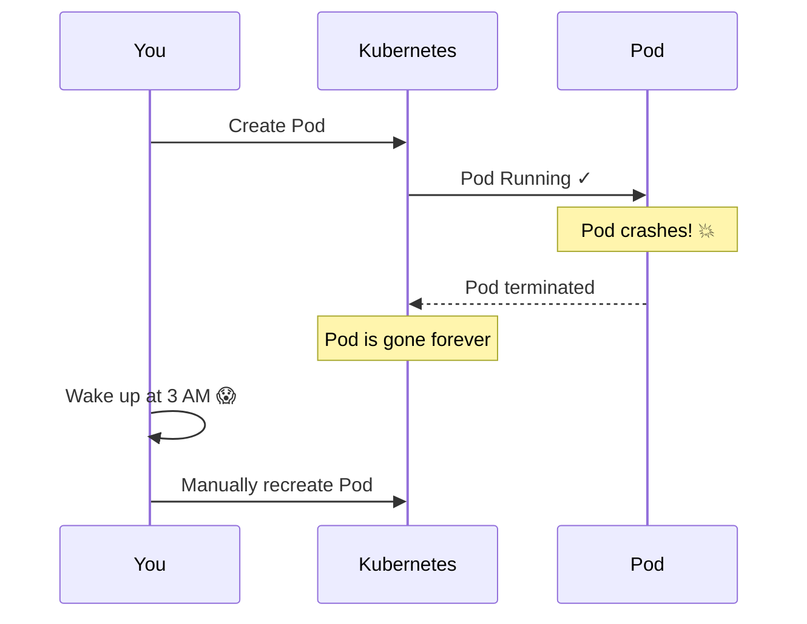
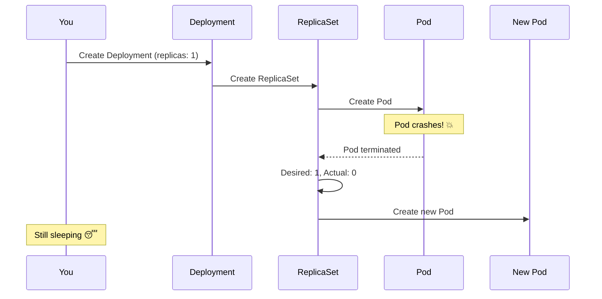
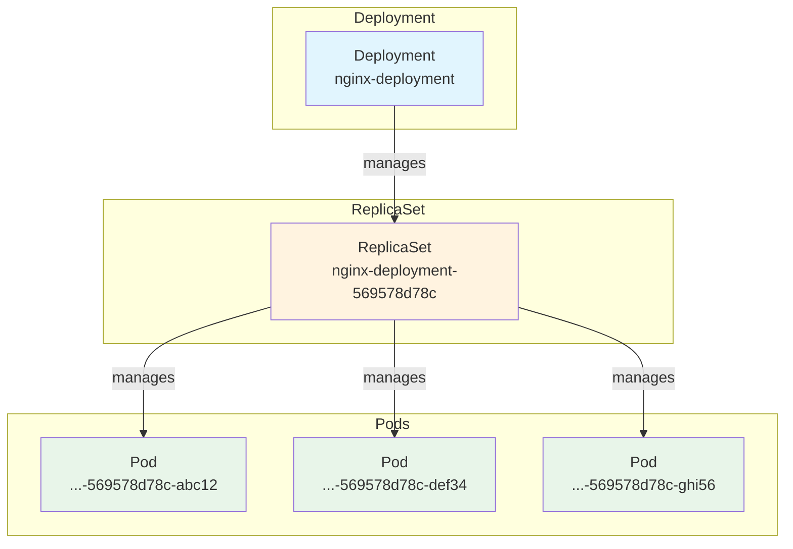
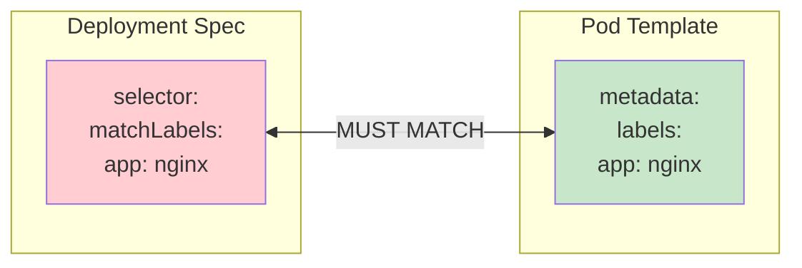
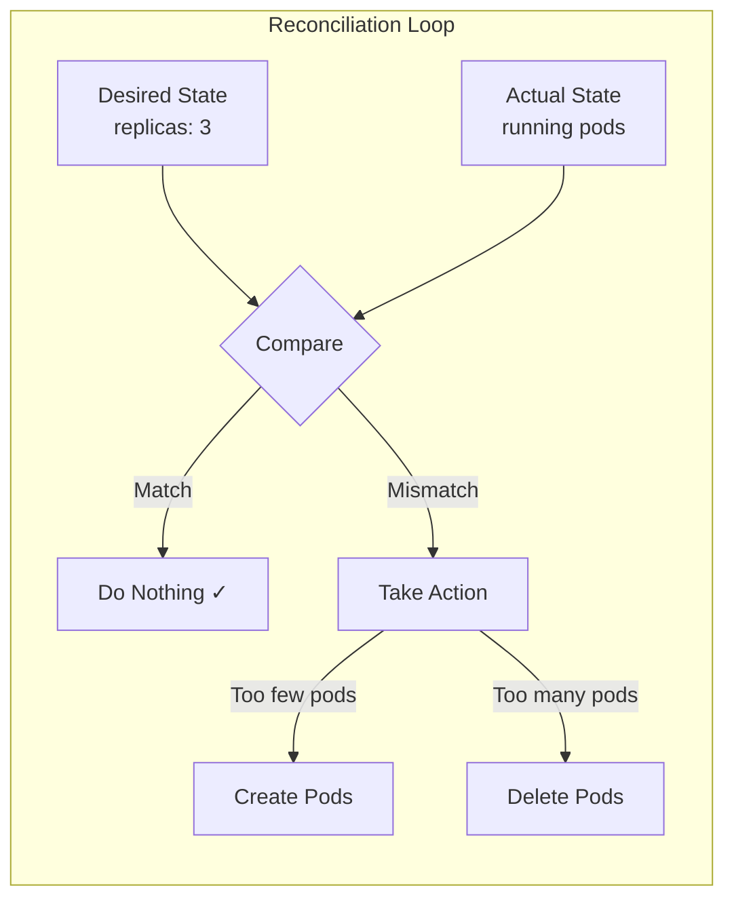
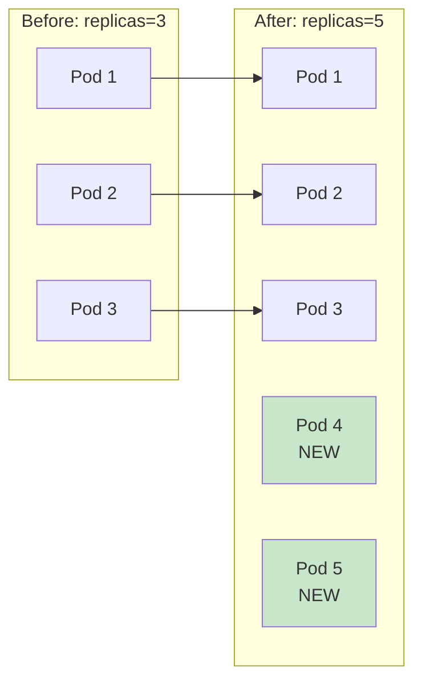
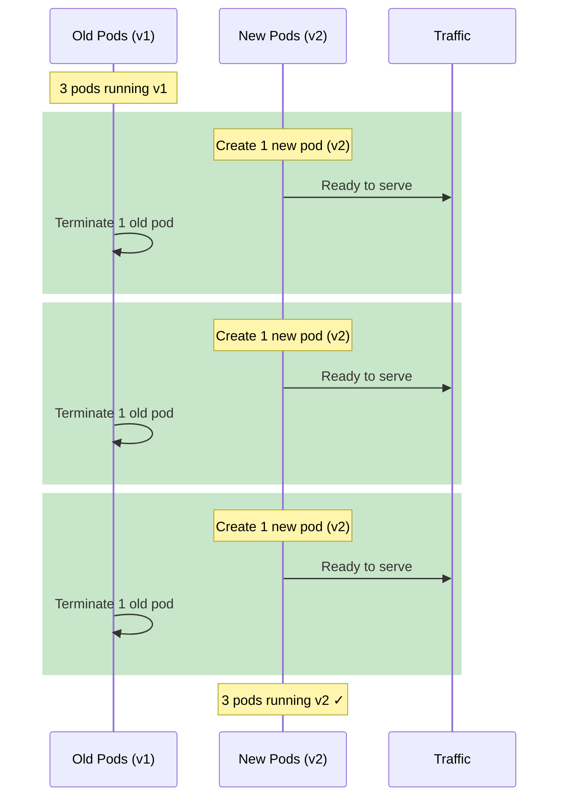
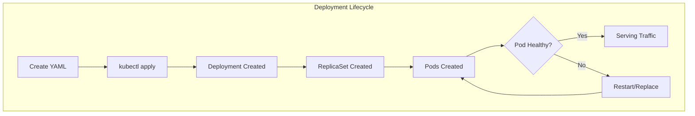

# Kubernetes Deployments

> A comprehensive guide to understanding Kubernetes Deployments

## Table of Contents

- [What is a Deployment?](#what-is-a-deployment)
- [The Problem Deployments Solve](#the-problem-deployments-solve)
- [Deployment Architecture](#deployment-architecture)
- [Creating a Deployment](#creating-a-deployment)
- [YAML Breakdown](#yaml-breakdown)
- [Key Features](#key-features)
- [Common Commands](#common-commands)
- [Best Practices](#best-practices)

---

## What is a Deployment?

A **Deployment** is a Kubernetes controller that manages Pods for you. Instead of creating Pods directly, you tell the Deployment what you want (desired state), and it ensures that state is always maintained.



**Key Insight**: You never create Pods directly in production. You create Deployments, and they create Pods for you.

---

## The Problem Deployments Solve

### Without Deployment (Naked Pod)



### With Deployment (Self-Healing)



---

## Deployment Architecture

### The Hierarchy



### Naming Convention

| Resource | Name Pattern | Example |
|----------|--------------|---------|
| Deployment | `<name>` | `nginx-deployment` |
| ReplicaSet | `<deployment>-<hash>` | `nginx-deployment-569578d78c` |
| Pod | `<replicaset>-<random>` | `nginx-deployment-569578d78c-abc12` |

The names show the hierarchy! You can trace any Pod back to its Deployment.

---

## Creating a Deployment

### Basic Deployment YAML

```yaml
apiVersion: apps/v1      # Deployments are in the "apps" API group
kind: Deployment
metadata:
  name: nginx-deployment
  labels:
    app: nginx

spec:
  replicas: 3            # Number of pod copies to maintain
  
  selector:              # How the Deployment finds its Pods
    matchLabels:
      app: nginx
  
  template:              # Pod template - what each Pod looks like
    metadata:
      labels:
        app: nginx       # MUST match selector.matchLabels!
    spec:
      containers:
      - name: nginx
        image: nginx:alpine
        ports:
        - containerPort: 80
        resources:
          limits:
            cpu: "200m"
            memory: "128Mi"
          requests:
            cpu: "100m"
            memory: "64Mi"
```

---

## YAML Breakdown

### The Critical Connection: Selector ↔ Labels



**Why?** The Deployment uses the selector to find which Pods belong to it. If they don't match, Kubernetes will reject the Deployment.

### Field Explanations

| Field | Description |
|-------|-------------|
| `apiVersion: apps/v1` | Deployments are in the "apps" API group (not core `v1`) |
| `kind: Deployment` | The resource type |
| `metadata.name` | Unique name for this Deployment |
| `spec.replicas` | Desired number of Pod copies |
| `spec.selector.matchLabels` | How to find Pods that belong to this Deployment |
| `spec.template` | The Pod specification (same as a Pod YAML, minus apiVersion/kind) |
| `spec.template.metadata.labels` | Labels applied to each Pod (must match selector!) |

---

## Key Features

### 1. Self-Healing



The controller constantly compares desired vs actual state and takes action to reconcile.

### 2. Scaling

```bash
# Scale up
kubectl scale deployment nginx-deployment --replicas=5

# Scale down
kubectl scale deployment nginx-deployment --replicas=2

# Or edit the YAML and apply
kubectl apply -f deployment.yaml
```



### 3. Rolling Updates

When you update the image or configuration:



**Zero downtime!** Old pods serve traffic until new pods are ready.

### 4. Rollback

```bash
# View rollout history
kubectl rollout history deployment nginx-deployment

# Rollback to previous version
kubectl rollout undo deployment nginx-deployment

# Rollback to specific revision
kubectl rollout undo deployment nginx-deployment --to-revision=2
```

---

## Common Commands

### Create/Update

```bash
# Create or update from YAML
kubectl apply -f deployment.yaml

# Create imperatively (not recommended for production)
kubectl create deployment nginx --image=nginx:alpine
```

### View

```bash
# List deployments
kubectl get deployments

# Detailed view
kubectl get deployments -o wide

# Describe (shows events, conditions)
kubectl describe deployment nginx-deployment

# View the generated YAML
kubectl get deployment nginx-deployment -o yaml
```

### Scale

```bash
# Scale to specific number
kubectl scale deployment nginx-deployment --replicas=5
```

### Update

```bash
# Update image
kubectl set image deployment/nginx-deployment nginx=nginx:1.21

# Edit directly
kubectl edit deployment nginx-deployment
```

### Rollout Management

```bash
# Check rollout status
kubectl rollout status deployment nginx-deployment

# View history
kubectl rollout history deployment nginx-deployment

# Rollback
kubectl rollout undo deployment nginx-deployment

# Pause rollout
kubectl rollout pause deployment nginx-deployment

# Resume rollout
kubectl rollout resume deployment nginx-deployment
```

### Delete

```bash
# Delete deployment (also deletes ReplicaSet and Pods)
kubectl delete deployment nginx-deployment

# Delete from YAML
kubectl delete -f deployment.yaml
```

---

## Best Practices

### 1. Always Use Resource Limits

```yaml
resources:
  limits:
    cpu: "500m"
    memory: "256Mi"
  requests:
    cpu: "100m"
    memory: "128Mi"
```

### 2. Use Meaningful Labels

```yaml
metadata:
  labels:
    app: my-api
    version: v1.2.3
    environment: production
    team: backend
```

### 3. Set Up Health Checks

```yaml
containers:
- name: my-app
  livenessProbe:
    httpGet:
      path: /health
      port: 8080
    initialDelaySeconds: 10
    periodSeconds: 5
  readinessProbe:
    httpGet:
      path: /ready
      port: 8080
    initialDelaySeconds: 5
    periodSeconds: 3
```

### 4. Use Rolling Update Strategy

```yaml
spec:
  strategy:
    type: RollingUpdate
    rollingUpdate:
      maxSurge: 1        # Max pods over desired during update
      maxUnavailable: 0  # Zero downtime
```

### 5. Never Use Naked Pods

| ❌ Don't | ✅ Do |
|---------|------|
| `kind: Pod` | `kind: Deployment` |
| Manual pod management | Declarative deployment |
| No self-healing | Automatic recovery |

---

## Pod vs Deployment Comparison

| Feature | Naked Pod | Deployment |
|---------|-----------|------------|
| Self-healing | ❌ No | ✅ Yes |
| Scaling | ❌ Manual | ✅ `kubectl scale` |
| Rolling updates | ❌ No | ✅ Zero-downtime |
| Rollback | ❌ No | ✅ `kubectl rollout undo` |
| Production use | ❌ Never | ✅ Always |

---

## Quick Reference



### Essential Commands Cheat Sheet

| Task | Command |
|------|---------|
| Create | `kubectl apply -f deployment.yaml` |
| List | `kubectl get deployments` |
| Details | `kubectl describe deployment <name>` |
| Scale | `kubectl scale deployment <name> --replicas=N` |
| Update image | `kubectl set image deployment/<name> <container>=<image>` |
| Rollback | `kubectl rollout undo deployment <name>` |
| Delete | `kubectl delete deployment <name>` |

---

## Related Resources

- [Services](./SERVICES.md) - Exposing Deployments to network traffic
- [ConfigMaps & Secrets](./CONFIGMAPS_SECRETS.md) - Configuration management
- [Kubernetes Mental Model](./KUBERNETES_MENTAL_MODEL.md) - Overall architecture

