# Kubernetes Services

> A comprehensive guide to understanding Kubernetes Services

## Table of Contents

- [What is a Service?](#what-is-a-service)
- [The Problem Services Solve](#the-problem-services-solve)
- [How Services Work](#how-services-work)
- [Service Types](#service-types)
- [Creating a Service](#creating-a-service)
- [YAML Breakdown](#yaml-breakdown)
- [DNS and Service Discovery](#dns-and-service-discovery)
- [Common Commands](#common-commands)
- [Best Practices](#best-practices)

---

## What is a Service?

A **Service** is a stable network endpoint that provides access to a group of Pods. It acts as an internal load balancer and gives Pods a consistent way to communicate, regardless of their changing IP addresses.

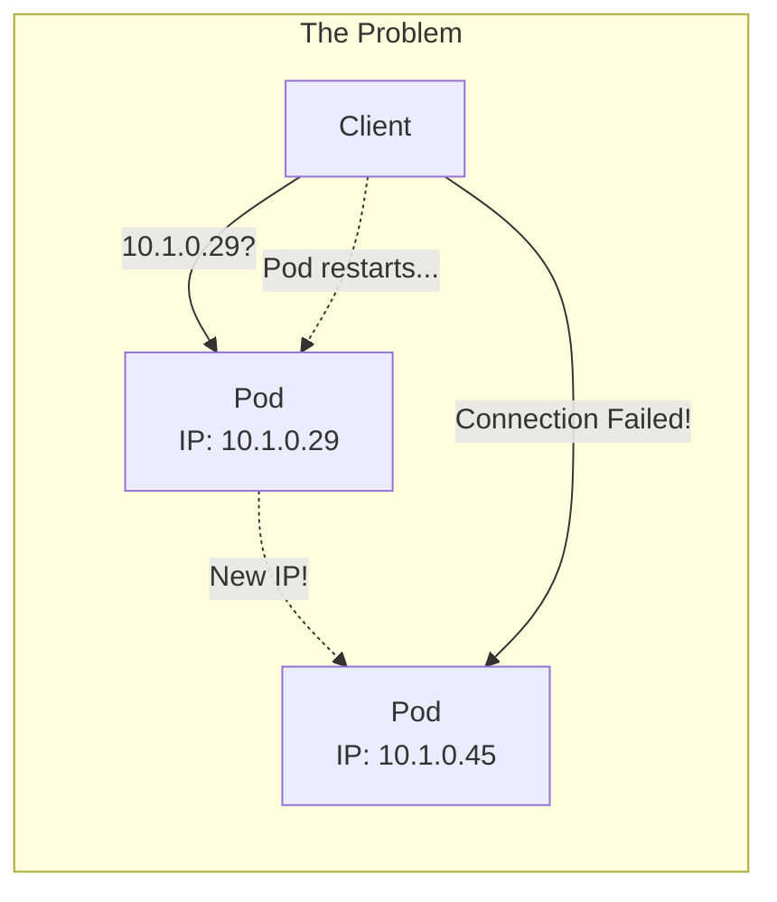

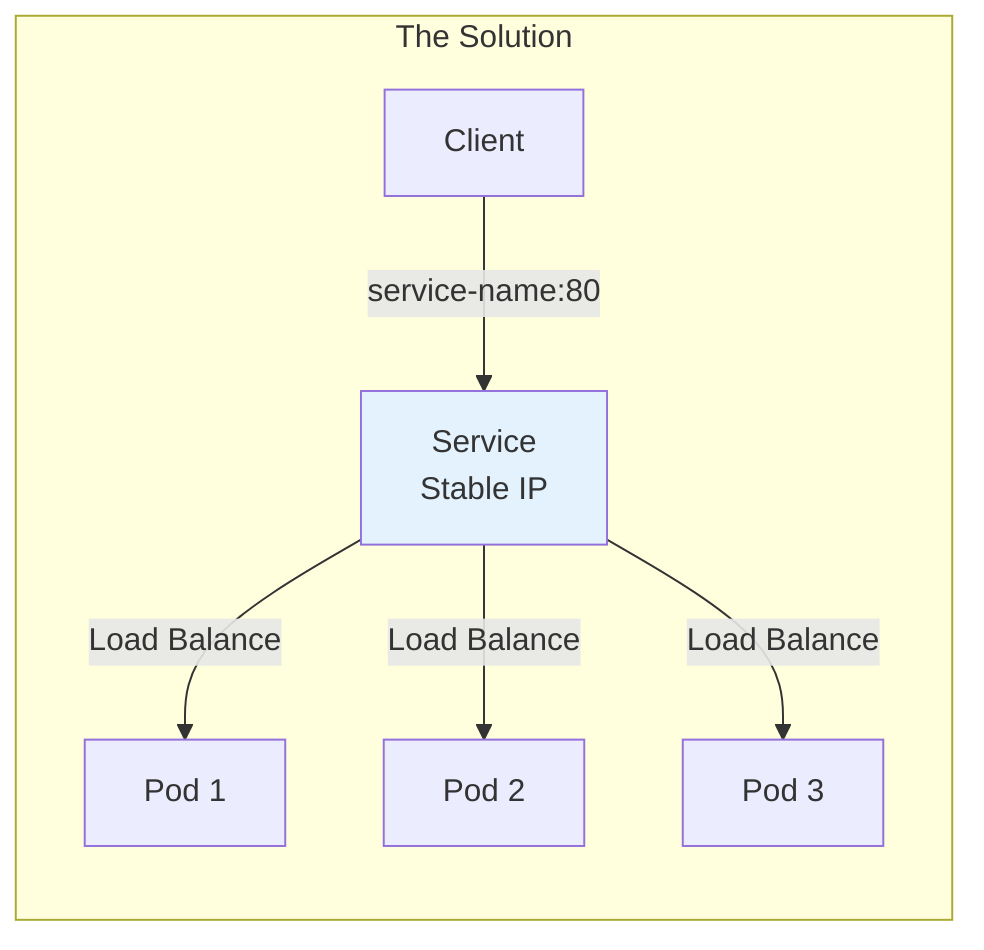

**Key Insight**: Clients connect to the Service (stable), not directly to Pods (ephemeral).

---

## The Problem Services Solve

### Pod IPs Are Ephemeral

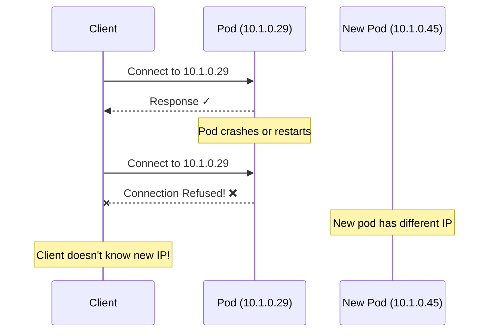

### With a Service

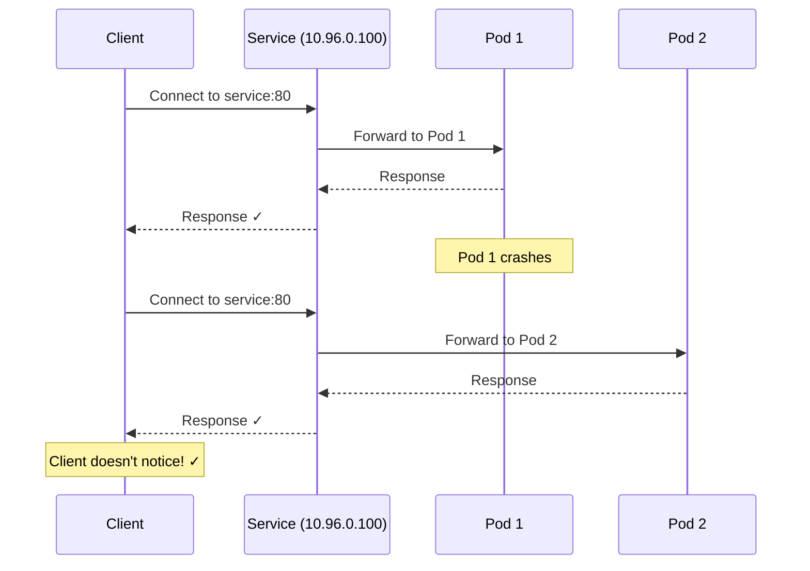

---

## How Services Work

### Label-Based Selection

Services find their target Pods using **label selectors**, just like Deployments.

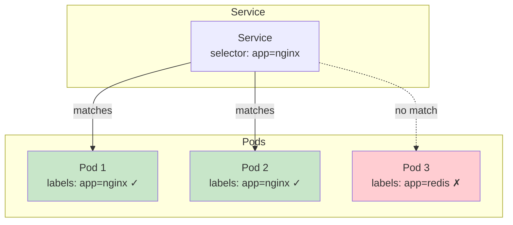

### Endpoints

The Service maintains a list of **Endpoints** - the actual Pod IPs it routes to.

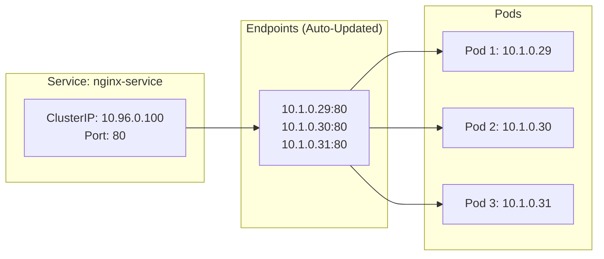

When Pods are added/removed, Kubernetes automatically updates the Endpoints list.

---

## Service Types

### Overview

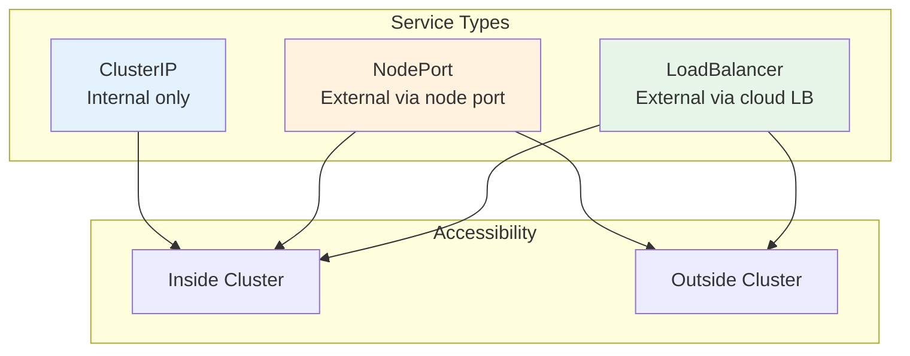

### 1. ClusterIP (Default)

Only accessible from **inside** the cluster.

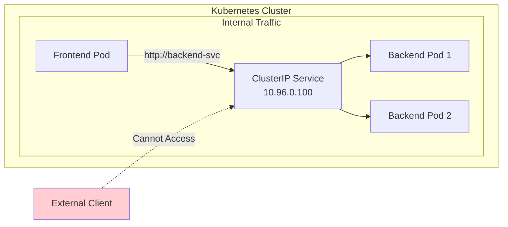

**Use cases:**
- Internal APIs
- Databases
- Caches (Redis, Memcached)
- Service-to-service communication

### 2. NodePort

Accessible from **outside** via `<NodeIP>:<NodePort>`.

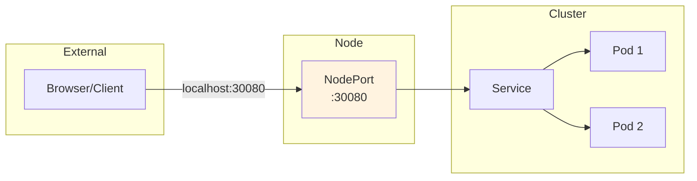

**Port range:** 30000-32767

**Use cases:**
- Development/testing
- Simple external access
- When you don't have a cloud load balancer

### 3. LoadBalancer

Gets an **external IP** from cloud provider (AWS, GCP, Azure).

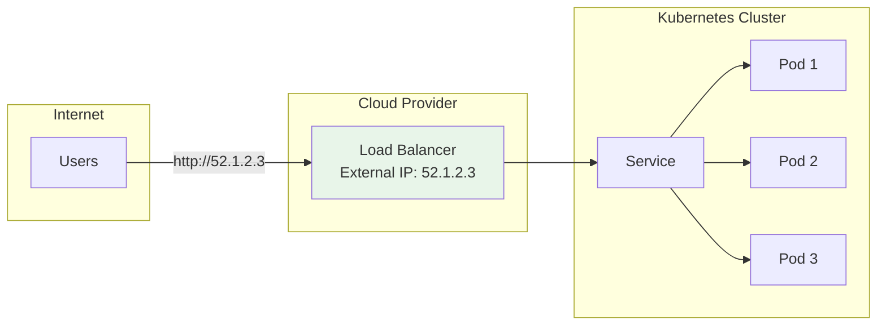

**Use cases:**
- Production external access
- Public-facing APIs
- Web applications

> **Note:** In Docker Desktop, LoadBalancer behaves like NodePort (no real external IP).

### Comparison Table

| Type | Internal Access | External Access | Use Case |
|------|----------------|-----------------|----------|
| ClusterIP | ✅ Yes | ❌ No | Internal services |
| NodePort | ✅ Yes | ✅ Via NodeIP:Port | Development, simple access |
| LoadBalancer | ✅ Yes | ✅ Via External IP | Production in cloud |

---

## Creating a Service

### ClusterIP Service

```yaml
apiVersion: v1
kind: Service
metadata:
  name: my-service

spec:
  type: ClusterIP        # Default, can be omitted
  
  selector:
    app: my-app          # Must match Pod labels
  
  ports:
    - name: http
      port: 80           # Service port
      targetPort: 8080   # Pod/container port
```

### NodePort Service

```yaml
apiVersion: v1
kind: Service
metadata:
  name: my-nodeport-service

spec:
  type: NodePort
  
  selector:
    app: my-app
  
  ports:
    - name: http
      port: 80           # Service port (internal)
      targetPort: 8080   # Pod port
      nodePort: 30080    # External port (30000-32767)
```

### LoadBalancer Service

```yaml
apiVersion: v1
kind: Service
metadata:
  name: my-loadbalancer-service

spec:
  type: LoadBalancer
  
  selector:
    app: my-app
  
  ports:
    - name: http
      port: 80
      targetPort: 8080
```

---

## YAML Breakdown

### Port Mapping Explained

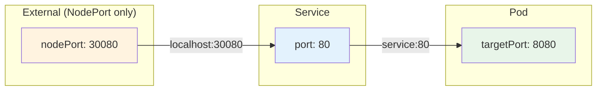

| Field | Description | Example |
|-------|-------------|---------|
| `port` | Port the Service listens on | Clients call `service:80` |
| `targetPort` | Port on the Pod/container | App runs on `8080` |
| `nodePort` | Port on the Node (NodePort only) | External calls `localhost:30080` |

### The Selector Connection

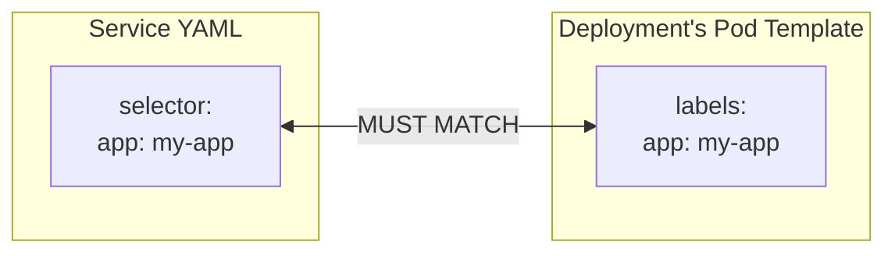

---

## DNS and Service Discovery

### Automatic DNS

Kubernetes automatically creates DNS entries for Services.

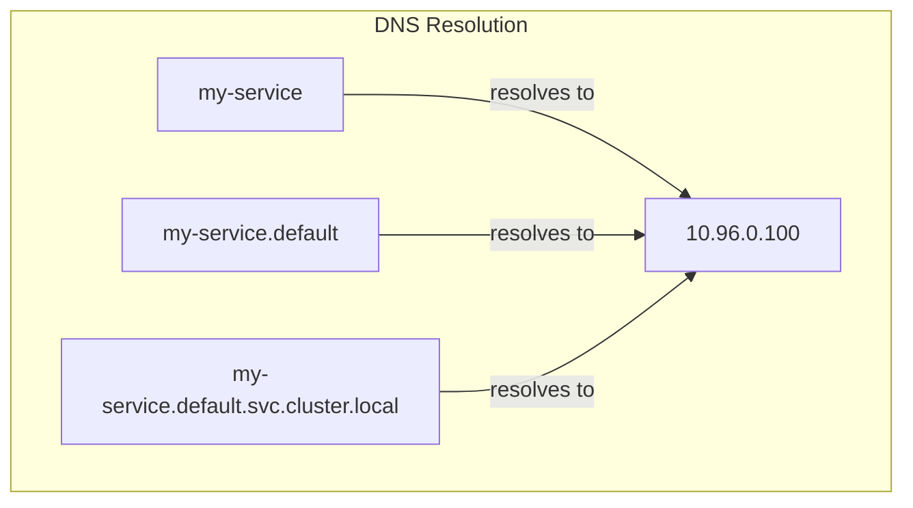

### DNS Formats

| Format | Description | Example |
|--------|-------------|---------|
| `<service>` | Short name (same namespace) | `redis` |
| `<service>.<namespace>` | Cross-namespace | `redis.cache` |
| `<service>.<namespace>.svc.cluster.local` | Fully qualified | `redis.cache.svc.cluster.local` |

### Using DNS in Your Code

```go
// Instead of hardcoding IPs
// ❌ Don't do this
client.Connect("10.96.0.100:6379")

// ✅ Do this - use service name
client.Connect("redis:6379")

// ✅ Or for cross-namespace
client.Connect("redis.cache:6379")
```

---

## Common Commands

### Create/Update

```bash
# Create or update from YAML
kubectl apply -f service.yaml

# Create imperatively
kubectl expose deployment my-deployment --port=80 --target-port=8080
```

### View

```bash
# List services
kubectl get services
kubectl get svc  # Short form

# Detailed view
kubectl get services -o wide

# Describe (shows endpoints, events)
kubectl describe service my-service

# View endpoints
kubectl get endpoints my-service
```

### Debug

```bash
# Test from inside cluster
kubectl run test --image=busybox --rm -it --restart=Never -- wget -qO- http://my-service:80

# Check if service resolves
kubectl run test --image=busybox --rm -it --restart=Never -- nslookup my-service
```

### Delete

```bash
# Delete service
kubectl delete service my-service

# Delete from YAML
kubectl delete -f service.yaml
```

---

## Best Practices

### 1. Name Your Ports

```yaml
ports:
  - name: http      # ✅ Named port
    port: 80
    targetPort: 8080
  - name: metrics   # ✅ Named port
    port: 9090
    targetPort: 9090
```

### 2. Use Consistent Labels

```yaml
# Deployment
spec:
  selector:
    matchLabels:
      app: my-api
      tier: backend
  template:
    metadata:
      labels:
        app: my-api
        tier: backend

---
# Service
spec:
  selector:
    app: my-api
    tier: backend    # Match all relevant labels
```

### 3. Use ClusterIP for Internal Services

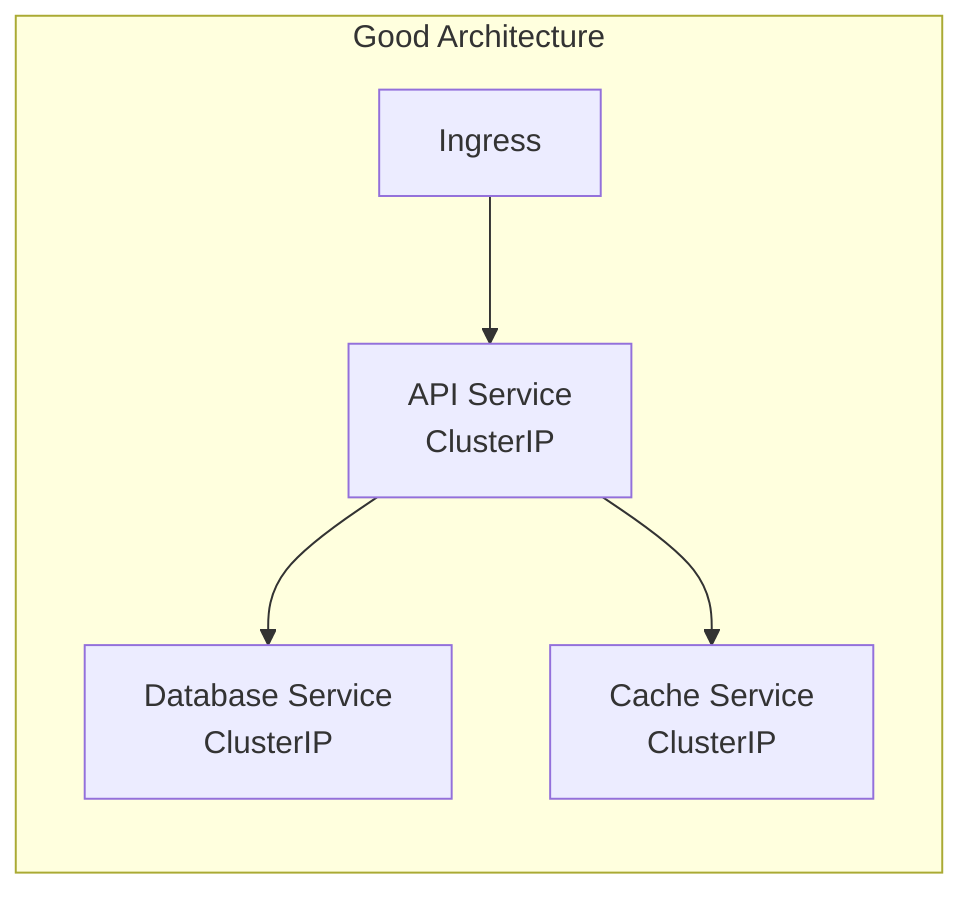

Only expose what needs external access.

### 4. Don't Expose Databases Externally

```yaml
# ❌ Don't do this in production
spec:
  type: NodePort  # Database exposed!
  selector:
    app: postgres

# ✅ Do this
spec:
  type: ClusterIP  # Internal only
  selector:
    app: postgres
```

### 5. Use Health Checks with Services

Services only route to **Ready** pods. Combine with readiness probes:

```yaml
# In your Deployment
containers:
- name: my-app
  readinessProbe:
    httpGet:
      path: /health
      port: 8080
    initialDelaySeconds: 5
    periodSeconds: 3
```

---

## Service vs Deployment Relationship

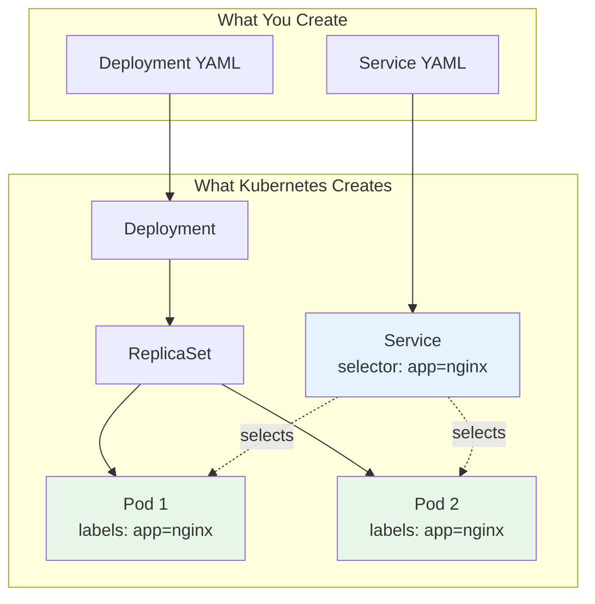

**Important:** Deployment and Service are **independent** resources. They're connected only through **labels**.

---

## Quick Reference

### Traffic Flow

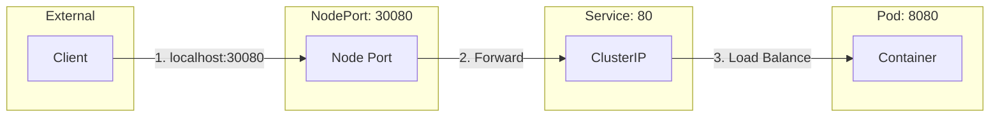

### Essential Commands Cheat Sheet

| Task | Command |
|------|---------|
| Create | `kubectl apply -f service.yaml` |
| List | `kubectl get services` |
| Details | `kubectl describe service <name>` |
| Endpoints | `kubectl get endpoints <name>` |
| Test | `kubectl run test --image=busybox --rm -it -- wget -qO- http://<service>` |
| Delete | `kubectl delete service <name>` |

### Service Types Decision Tree

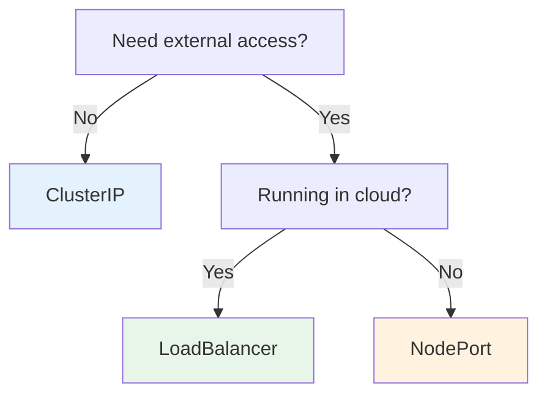

---

## Related Resources

- [Deployments](./DEPLOYMENTS.md) - Managing Pod replicas
- [ConfigMaps & Secrets](./CONFIGMAPS_SECRETS.md) - Configuration management
- [Ingress](./INGRESS.md) - HTTP routing and TLS
- [Kubernetes Mental Model](./KUBERNETES_MENTAL_MODEL.md) - Overall architecture

